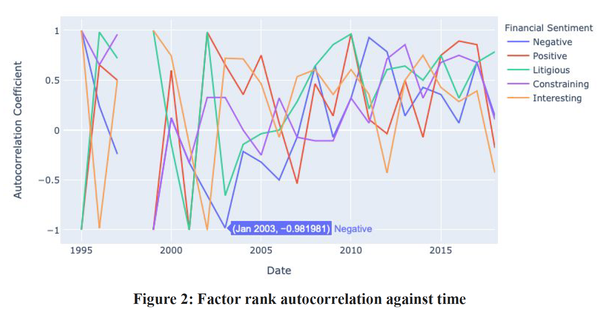
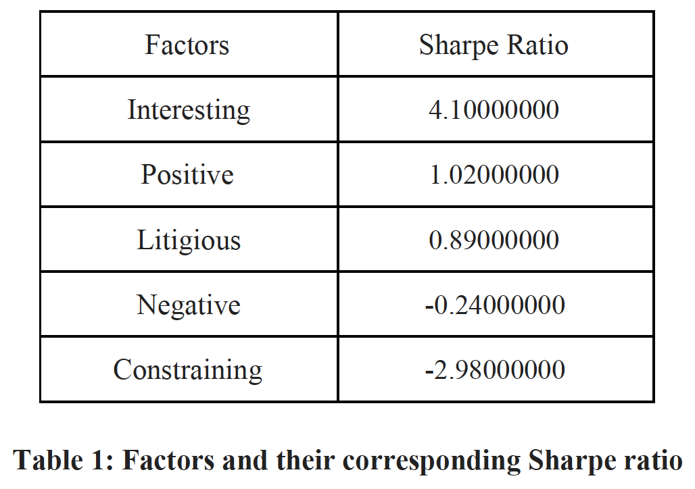

# StockGram : An Intelligent Portfolio Manager

## Overview
This project attempts to analyze if the tone of financial 10-K reports can determine the company’s future
mean returns. A diverse portfolio of stocks was selected to test this hypothesis. The proposed framework
downloads 10-K reports of the companies from SEC’s EDGAR database. It passes them through the
preprocessing pipeline to extract critical sections of the filings to perform NLP analysis. Using Loughran
McDonald sentiment word list, the framework generates sentiment TF-IDF from the 10-K documents
to calculate the cosine similarity between each tick in time. The framework proposes to leverage this
cosine similarity as the alpha factor. For analyzing the effectiveness of our alpha factor at predicting
future returns, the framework uses Alphalens to perform factor return, factor autocorrelation, and Sharpe
ratio analysis. In the end, this paper observed the existence of a strong correlation between the sentiment
conveyed by the financial 10-K document and the corresponding future mean returns.

## Code

You can find the PyTorch implementation of the framework [here](https://github.com/purvasingh96/StockGram-Intelligent-Portfolio-Manager/tree/main/code)

## Evaluation and Results

### Factor Returns

This project will be leveraging cosine similarity between each tick in time as our alpha factor.
Alphalens gives us a full battery of tests from future returns, information analysis to turnover
analysis that provides us with a sense of the predictive power of an individual factor. One
useful parameter is the return of our factor, which is called the factor return . In other words,
factor returns are a way to directly measure the returns of our portfolio if their weights were
determined purely by the alpha factor. Alphalens requires two mandatory arguments to
predict future mean returns: factors and prices. In this paper, we consider cosine
similarity as factor data and year-end adjusted closing prices of the stocks in our portfolio as
pricing data to run against our factor data.  

After generating the factor data frame and setting the pricing data, we pass both the arguments
in the alphalens’ method called get_clean_factor_and_forward_returns, which accepts factor
data, pricing data, quantiles, bins, and periods. This function generates a multi-indexed
merged data frame that is indexed by date at level 0 and followed by stock/asset at level 1. This
data frame contains the values for a single alpha factor, forward returns for each period, and
quantile/bin in which the signal belongs.  

</img>  

Figure 1 shows a plot between factor returns and time. As we can see from the graph, 10-K
financial reports expressing the sentiment interesting and positive, yield the maximum returns.
On the other hand, the forms that convey constraining , negative , and litigious resulted in the
lowest returns. The following observation aligns with our hypothesis that performing NLP
analysis on financial 10-K statements could predict future mean returns.

### Turnover Analysis

Since liquidity and transaction costs are dependent upon market conditions at the time of the
trade, it is challenging to simulate actual transaction costs when evaluating an Alpha factor. So a
useful proxy for these real-world constraints is to measure the turnover. The turnover
analysis estimates the fraction of the portfolio's total value getting traded in a period. One of
the ways to measure turnover is factor rank autocorrelation . Factor rank autocorrelation is a
way to measure how stable are the ranked alpha factors. In this case, stability refers to the fact that alpha ranks do not change much from period to period. Since trading is costly, we would
always prefer other factors to be the same, i.e., the alpha factor’s ranks do not change
significantly per period. A high factor rank autocorrelation is an indication that the turnover
is lower. A low or even a negative autocorrelation is a proxy to indicate a higher turnover. If
two alpha factors have similar quintile performance and similar factor returns, we would prefer
the one with lower turnover.  

</img>  

The reason for choosing alpha factor with lower turnover is that it makes it possible for us to
execute trades if we have liquid stocks and reduce transaction costs. Excessive turnover could
imply that our Alpha factor is only catching noise.

### Sharpe Ratio
The Sharpe Ratio or risk-adjusted return is a critical metric in evaluating alpha factors. It is the
measure of excess portfolio return over the risk-free rate relative to its standard deviation.
Sharpe ratio helps us to compare the relative performance of alpha factors. One important thing
to note is that the Sharpe ratio is the key and not the magnitude of factor returns. Table 1 shows the Sharpe ratio of our alpha factors. Usually, a ratio under 1.0 is considered
sub-optimal. Sharpe ratio greater than 1.0 is acceptable to good by investors. A Sharpe ratio
higher than 2.0 is good, and investors deem a 3.0 or higher Sharpe ratio excellent.
Looking at the Sharpe ratio of our Alpha factor, we can see that the 10-K filing reports that
convey the sentiment interesting have the highest Sharpe ratio of 4.10, followed by the 10-K
documents that express a positive view with a Sharpe ratio of 1.02.  

</img>  

